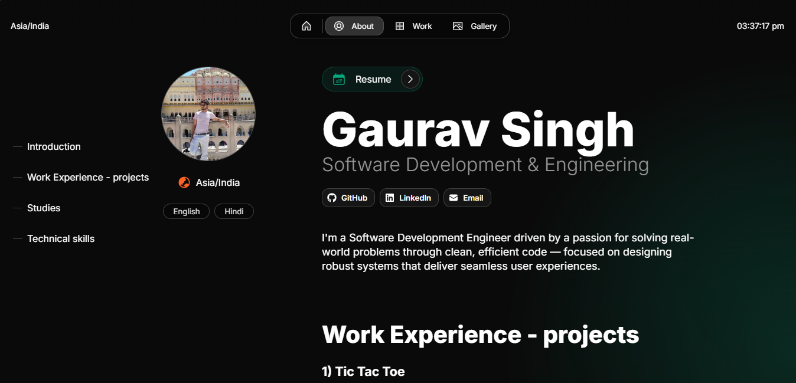

# 🧑‍💻 My Developer Portfolio

This is a personal portfolio website built with **Next.js** and **Tailwind CSS**. It showcases my projects, skills, experience, and contact information — all in a sleek, responsive design.

View the [demo here](https://portfoliogs79.netlify.app/).




# **Getting started**

**1. Clone the repository**
```
git clone https://github.com/GauravSingh696/Portfolio.git
```

**2. Install dependencies**
```
npm install
```

**3. Run dev server**
```
npm run dev
```

**4. Edit config**
```
src/app/resources/config
```

## 🚀 Features

- ⚡ Blazing fast with Next.js (optimized for performance)
- 💅 Beautiful, responsive UI using Tailwind CSS
- 📱 Mobile-friendly layout
- 🧩 Project showcase section
- 📜 Resume download
- 📧 Contact form
- 📬 Social media links

## 🛠️ Tech Stack

- **Framework:** [Next.js](https://nextjs.org/)
- **Styling:** [Tailwind CSS](https://tailwindcss.com/)
- **Deployment:** Vercel / Netlify / Your preferred host

# **[Deploy with Netlify](https://netlify.com/)**
